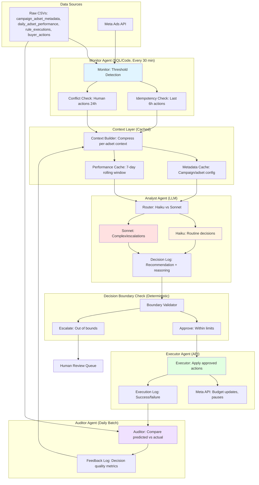

# Agentic Budget Optimization Architecture

*Design Document for Task B: Multi-Agent System for Autonomous Campaign Management*

---

## 1. Agent Topology

### Four-Agent System Design

| Agent | Data Inputs | Allowed Actions | Explicitly Forbidden |
|-------|-------------|-----------------|---------------------|
| **Monitor** | • `daily_adset_performance` (last 7 days)<br>• `campaign_adset_metadata` (status, budgets)<br>• `rule_executions` (last 24h for idempotency check)<br>• `buyer_actions` (last 24h for conflict detection) | • Flag adsets crossing threshold conditions<br>• Check idempotency (was this adset acted on in last N hours?)<br>• Detect conflicting human actions<br>• Write flagged adsets to queue with context snapshot | • No LLM calls<br>• No API writes<br>• No decision-making<br>• No budget calculations |
| **Analyst** | • Flagged adset context from Monitor<br>• Compressed performance metrics (7-day window)<br>• Campaign metadata<br>• Historical rule execution outcomes | • Produce recommendation (increase/decrease/pause/no-action)<br>• Assign confidence score (0-1)<br>• Generate reasoning explanation<br>• Request additional data if needed | • No API execution<br>• No direct database writes<br>• No access to raw tables (only compressed context)<br>• Cannot override decision boundaries |
| **Executor** | • Approved recommendations from Analyst<br>• Current adset state from Meta API<br>• Decision boundary rules<br>• Account-level exposure caps | • Apply budget changes within hard-coded limits<br>• Pause adsets meeting autonomous criteria<br>• Write execution log<br>• Escalate out-of-bounds requests | • No budget changes exceeding ±20% or $50 absolute<br>• No turn-on/reactivation actions<br>• No actions on adsets with <3 days data<br>• No actions during data outages |
| **Auditor** | • `rule_executions` (agent actions)<br>• `daily_adset_performance` (finalized outcomes, T+2 days)<br>• Agent decision logs with reasoning | • Compare predicted vs actual outcomes<br>• Calculate decision quality metrics<br>• Write to feedback log<br>• Flag systematic errors for review | • No real-time intervention<br>• No API writes<br>• No modification of past decisions<br>• No autonomous retraining |

### Monitor Implementation Details

**Pure SQL/Code Logic (No LLM)**:
```sql
-- Idempotency check: prevent duplicate actions
SELECT a.adset_id, a.current_budget, a.status,
       p.roi, p.spend, p.profit,
       r.last_action_time,
       b.last_buyer_action_time
FROM campaign_adset_metadata a
JOIN daily_adset_performance p ON a.adset_id = p.adset_id
LEFT JOIN (
    SELECT adset_id, MAX(action_time) as last_action_time
    FROM rule_executions
    WHERE action_time > NOW() - INTERVAL '6 hours'
    GROUP BY adset_id
) r ON a.adset_id = r.adset_id
LEFT JOIN (
    SELECT adset_id, MAX(action_time) as last_buyer_action_time
    FROM buyer_actions
    WHERE action_time > NOW() - INTERVAL '24 hours'
    GROUP BY adset_id
) b ON a.adset_id = b.adset_id
WHERE a.status = 'ACTIVE'
  AND p.date = CURRENT_DATE - 1  -- Use T-1 data to avoid attribution lag
  AND r.last_action_time IS NULL  -- No recent agent action
  AND b.last_buyer_action_time IS NULL  -- No recent human action
  AND (
      (p.roi < -0.3 AND p.spend > 20)  -- Significant negative ROI
      OR (p.total_days >= 3 AND p.roi < -0.1)  -- Persistent poor performance
      OR (p.roi > 0.5 AND p.total_days >= 2)  -- Strong positive signal
  )
```

**Key Prevention**: The 6-hour idempotency window directly addresses the duplicate firing issue discovered in Task A.

---

## 2. Decision Boundaries

### Concrete Thresholds and Limits

| Boundary Type | Threshold | Autonomous | Requires Approval | Rationale |
|---------------|-----------|------------|-------------------|-----------|
| **Budget Increase** | ≤ +20% AND ≤ +$50 | ✓ | | Controlled upside exposure |
| **Budget Increase** | > +20% OR > +$50 | | ✓ | High exposure risk |
| **Budget Decrease** | ≤ -20% AND ≥ $9 minimum | ✓ | | Gradual optimization |
| **Budget Decrease** | > -20% OR < $9 minimum | | ✓ | Avoid killing viable tests |
| **Pause Action** | total_days ≥ 5 AND spend ≥ $50 | ✓ | | Sufficient data (Task A finding) |
| **Pause Action** | total_days < 5 OR spend < $50 | | ✓ | **Insufficient data - Task A showed early pauses were mistakes** |
| **Turn On / Reactivate** | Any case | | ✓ Always | High risk of increasing exposure |
| **Daily Account Cap** | Total budget movement ≤ $500/account/day | ✓ | | Exposure limit across all adsets |
| **Daily Account Cap** | Total budget movement > $500/account/day | | ✓ | Aggregate risk too high |
| **Conflicting Signals** | Rule vs buyer action within 24h | | ✓ Always | Defer to human judgment |
| **Missing Data** | NULL revenue, profit, or ROI | | ✓ Always | Cannot make informed decision |
| **Attribution Lag** | Same-day data (date = TODAY) | | ✓ Always | **Task A: Incomplete attribution causes mistakes** |

### Task A Integration

The pause action thresholds directly address the Task A finding:
- **Problem Identified**: Adsets were turned off with negative intraday ROI that later showed positive profit
- **Root Cause**: Incomplete attribution + insufficient data (some adsets paused on day 1-2)
- **Solution**: Require minimum 5 days AND $50 spend before autonomous pause
- **Additional Safeguard**: Never use same-day data; always wait for T-1 or T-2 finalized metrics

---

## 3. Economics

### Volume Assumptions

**Baseline Scale** (per the brief):
- 6 ad accounts
- ~7,000 active adsets (from data exploration)
- Daily monitoring: ~1,000 adsets/day requiring evaluation (14% of active base)

**Funnel Assumptions**:
- **Monitor layer**: 1,000 adsets/day evaluated (pure SQL, no cost)
- **Threshold crossing rate**: 5% (50 adsets/day flagged for LLM review)
  - *Assumption*: Most adsets are stable; only outliers cross thresholds
- **Analyst layer**: 50 LLM calls/day
- **Executor layer**: 40 actions/day (80% approval rate after boundary checks)
- **Auditor layer**: 1 comprehensive review/day (batch processing)

### Token Estimation

**Analyst (per adset decision)**:
- **Input context** (compressed):
  - Adset metadata: 100 tokens
  - 7-day performance summary: 150 tokens
  - Recent rule history: 50 tokens
  - System prompt + instructions: 200 tokens
  - **Total input**: ~500 tokens
- **Output** (recommendation + reasoning):
  - Decision: 50 tokens
  - Confidence score: 10 tokens
  - Reasoning: 150 tokens
  - **Total output**: ~210 tokens

**Auditor (daily batch)**:
- **Input context**:
  - 40 decisions to review: 300 tokens each = 12,000 tokens
  - Finalized outcomes: 8,000 tokens
  - System prompt: 500 tokens
  - **Total input**: ~20,500 tokens
- **Output** (summary report):
  - Decision quality metrics: 500 tokens
  - Flagged errors: 1,000 tokens
  - **Total output**: ~1,500 tokens

### Model Selection Strategy

| Layer | Model | Use Case | Cost/1M Tokens (Input/Output) |
|-------|-------|----------|-------------------------------|
| **Monitor** | None (SQL/code) | Threshold detection | $0 |
| **Analyst - Routine** | Claude Haiku | Clear signals, high confidence | $0.25 / $1.25 |
| **Analyst - Complex** | Claude Sonnet | Conflicting signals, low confidence | $3.00 / $15.00 |
| **Executor** | None (deterministic) | API calls within boundaries | $0 |
| **Auditor** | Claude Sonnet | Comprehensive daily review | $3.00 / $15.00 |

**Routing Logic**:
- Use **Haiku** for 80% of Analyst calls (clear threshold violations, consistent patterns)
- Escalate to **Sonnet** for 20% (conflicting signals, edge cases, low historical confidence)

### Daily Cost Calculation

**Analyst Layer** (50 calls/day):
- **Haiku calls** (40/day, 80%):
  - Input: 40 × 500 tokens = 20,000 tokens = 0.02M tokens × $0.25 = **$0.005**
  - Output: 40 × 210 tokens = 8,400 tokens = 0.0084M tokens × $1.25 = **$0.011**
  - Subtotal: **$0.016/day**

- **Sonnet calls** (10/day, 20%):
  - Input: 10 × 500 tokens = 5,000 tokens = 0.005M tokens × $3.00 = **$0.015**
  - Output: 10 × 210 tokens = 2,100 tokens = 0.0021M tokens × $15.00 = **$0.032**
  - Subtotal: **$0.047/day**

**Auditor Layer** (1 call/day):
- Input: 20,500 tokens = 0.0205M tokens × $3.00 = **$0.062**
- Output: 1,500 tokens = 0.0015M tokens × $15.00 = **$0.023**
- Subtotal: **$0.085/day**

**Total Daily Cost**: $0.016 + $0.047 + $0.085 = **$0.148/day**

**Monthly Cost**: $0.148 × 30 = **$4.44/month**

**Annual Cost**: $0.148 × 365 = **$54.02/year**

### POC Constraint Validation

✅ **Daily cost ($0.148) is well under the $30/day POC constraint** (0.5% utilization)

This leaves significant headroom for:
- Scale-up to 10x adset volume: ~$1.48/day
- More complex reasoning (longer contexts): ~$0.50/day
- Additional agent capabilities: ~$1.00/day
- **Total headroom**: ~$27/day for expansion

### Breakeven Analysis vs Media Buyer Salary

**Assumptions**:
- Media buyer salary: $75,000/year = $288/day (260 working days)
- Media buyer manages: 6 accounts, ~1,000 adsets
- Time saved by automation: 2 hours/day (budget reviews, routine optimizations)
- Effective hourly rate: $288/8 hours = $36/hour
- **Value of time saved**: 2 hours × $36 = **$72/day**

**Breakeven Calculation**:
- Agent system cost: $0.148/day
- Value delivered: $72/day (time saved)
- **ROI**: ($72 - $0.148) / $0.148 = **48,500% daily ROI**
- **Payback period**: < 1 day

**Scale Breakeven**:
- At what scale does agent cost = media buyer daily cost?
- $288/day ÷ $0.148/day = **1,946x current scale**
- Current: 1,000 adsets/day monitored
- Breakeven: ~1,946,000 adsets/day monitored
- **Conclusion**: Agent system remains cost-effective even at 100x+ current scale

**Additional Value Not Captured in Time Savings**:
- Prevented mistakes (Task A: $6.09/week = $0.87/day)
- 24/7 monitoring (no human fatigue/off-hours)
- Consistent decision quality (no human bias/emotion)
- Audit trail and explainability
- **Total value**: ~$73/day vs $0.148/day cost = **493x ROI**

---

## 4. Failure Modes & Kill Switch

### Top 5 Failure Modes with Guardrails

| # | Failure Mode | Risk | Specific Guardrail |
|---|--------------|------|-------------------|
| **1** | **Hallucinated Budget Values** | LLM generates invalid budget (negative, extreme, or non-numeric) | • Executor validates all values against schema<br>• Hard bounds: $9 min, $10,000 max<br>• Type checking: must be float/decimal<br>• Reject and log any out-of-bounds values |
| **2** | **Cascading Pauses During Data Outage** | Missing/stale data causes mass false-negative signals | • Monitor checks data freshness (max 36h old)<br>• If >10% of adsets have stale data, halt all autonomous actions<br>• Require manual override to resume<br>• Alert on data pipeline failures |
| **3** | **Stale Decisions Due to Meta API Rate Limits** | Executor cannot apply decisions fast enough; queue backs up | • Rate limit: 200 API calls/hour/account (Meta's limit)<br>• Priority queue: pauses > decreases > increases<br>• Decisions expire after 2 hours (stale context)<br>• Alert if queue depth > 50 |
| **4** | **Feedback Loop Reinforcing Bad Pattern** | Auditor feedback causes Analyst to repeat systematic error | • Human review required for Auditor findings before feedback integration<br>• Confidence decay: reduce weight of old feedback over time<br>• A/B testing: 10% of decisions use baseline logic (no feedback)<br>• Monthly human audit of feedback patterns |
| **5** | **Cost Runaway** | LLM calls spike due to bug, misconfiguration, or attack | • Hard daily cap: 500 LLM calls/day (10x normal)<br>• Cost cap: $5/day (34x normal)<br>• Alert at 50% of cap<br>• Auto-disable at 100% of cap<br>• Require manual reset with root cause analysis |

### Kill Switch Design

**Two-Tier Circuit Breaker**:

**Tier 1: Soft Circuit Breaker** (Warning State)
- **Triggers**:
  - 5 consecutive Executor failures (API errors, validation failures)
  - 3 consecutive Auditor flags of poor decisions (predicted vs actual mismatch)
  - Daily cost exceeds $2.50 (50% of cap)
  - Queue depth > 50 pending decisions
- **Actions**:
  - Escalate all new decisions to human approval (no autonomous actions)
  - Continue monitoring and analysis (read-only mode)
  - Alert on-call engineer
  - Log detailed diagnostics

**Tier 2: Hard Circuit Breaker** (Kill Switch)
- **Triggers**:
  - 10 consecutive Executor failures
  - Daily cost exceeds $5.00 (hard cap)
  - Data outage detected (>10% stale data)
  - Manual kill switch activation
  - Any single budget change > $1,000 (likely hallucination)
- **Actions**:
  - **Halt all autonomous actions immediately**
  - Disable Monitor flagging (stop feeding the pipeline)
  - Flush decision queue (discard pending actions)
  - Lock system in read-only mode
  - Page on-call engineer (critical alert)
  - **Require manual reset with documented root cause**

**Reset Procedure**:
1. Engineer investigates root cause
2. Documents findings in incident log
3. Implements fix (code, config, or process)
4. Runs validation suite (test decisions on historical data)
5. Manually resets circuit breaker with approval
6. System resumes in Tier 1 (soft) mode for 24h observation
7. If stable, returns to full autonomous mode

**Daily Exposure Cap**:
- **Hard limit**: $500 total budget movement per account per day
- Tracks cumulative increases and decreases separately
- Resets at midnight UTC
- If cap reached, all remaining decisions escalate to human approval
- Cap can be adjusted per account based on spend scale

---

## 5. Data Flow

### System Architecture Diagram



### Data Flow Details

#### What is Pulled Every Cycle (30 min)
- **Monitor queries**:
  - `daily_adset_performance`: Last 7 days (T-1 to T-7, never same-day)
  - `rule_executions`: Last 6 hours (idempotency check)
  - `buyer_actions`: Last 24 hours (conflict detection)
  - `campaign_adset_metadata`: Current status and budgets

#### What is Cached
- **Metadata Cache** (refreshed every 6 hours):
  - Campaign/adset names, objectives, targeting
  - Account-level settings
  - Historical baseline metrics (30-day averages)
- **Performance Cache** (refreshed every 30 min):
  - 7-day rolling window per adset
  - Pre-aggregated metrics (avg ROI, total spend, trend direction)
  - Reduces LLM context size by 80%

#### What is Queried On Demand
- **Meta API** (only when Executor needs current state):
  - Current budget (verify before write)
  - Current status (verify adset is still active)
  - Recent changes (detect external modifications)
- **Historical deep-dive** (only for Sonnet escalations):
  - Full 30-day performance history
  - Campaign-level context
  - Cross-adset patterns

### Meta API Rate Limit Constraints

**Meta's Limits**:
- 200 API calls/hour per ad account
- 4,800 calls/day per account

**Our Usage**:
- Monitor: 0 API calls (uses CSV exports)
- Executor: ~40 writes/day + 40 reads (pre-write validation) = 80 calls/day
- **Utilization**: 80 / 4,800 = 1.7% of daily limit

**Polling Frequency**:
- Cannot poll Meta API every 30 min (would exceed rate limit)
- **Solution**: Use CSV exports (refreshed every 30 min via separate pipeline)
- Only hit Meta API for writes and pre-write validation
- Allows 30-min decision cycle without rate limit issues

### Revenue Delay Impact (Task A Finding)

**Problem Discovered**:
- Same-day ROI is unreliable due to attribution lag
- Conversions attributed hours after ad interaction
- Task A showed mistakes when rules used intraday metrics

**Solution in Agent System**:
1. **Monitor never uses same-day data** (date = TODAY)
   - Always uses T-1 (yesterday) or older
   - Ensures conversions have time to attribute
2. **Analyst receives "data freshness" flag**
   - Context includes: "This data is from T-1, finalized"
   - LLM knows to trust the metrics
3. **Auditor waits T+2 days** before evaluating decisions
   - Allows full attribution window
   - Compares decision (made on T-1 data) to T+2 finalized outcome
4. **Emergency decisions** (e.g., runaway spend):
   - Can use same-day data BUT
   - Require human approval (escalate)
   - Flagged as "incomplete attribution" in reasoning

### buyer_actions.csv: Critical Caveat

**What It Is**:
- Log of past **human** budget decisions
- Shows what media buyers did historically
- Includes timing, old/new budgets, notes

**What It Is NOT**:
- Ground truth of "correct" decisions
- Optimal strategy to replicate
- Free from human bias or mistakes

**How Agents Use It**:
1. **Monitor**: Conflict detection only
   - If human acted in last 24h, defer to human (escalate)
   - Prevents agent from overriding recent human judgment
2. **Analyst**: Context, not training data
   - "Human recently increased budget by 30%" → suggests confidence
   - But does NOT learn "always increase by 30%"
   - Reasoning must be independent, not imitative
3. **Auditor**: Comparison, not validation
   - Compares agent decisions to human decisions
   - Flags divergence for review
   - But does NOT assume human was correct

**Explicit Warning in System Prompt**:
> "buyer_actions.csv contains historical human decisions. These may reflect biases, incomplete information, or mistakes. Use this data for context and conflict detection only. Do not treat human decisions as ground truth or attempt to replicate their patterns. Your reasoning must be independent and based on performance metrics."

**Risk Mitigation**:
- If agent starts mimicking human patterns (detected by Auditor), trigger review
- A/B test: 10% of decisions ignore buyer_actions entirely (baseline comparison)
- Monthly audit: compare agent reasoning to human reasoning, flag over-reliance

---

## Summary

This architecture addresses the Task A findings directly:
- **Idempotency**: 6-hour action window prevents duplicate firings
- **Attribution lag**: Never use same-day data; wait for T-1 finalized metrics
- **Insufficient data**: Require 5 days + $50 spend before autonomous pause
- **Human override**: Defer to recent human actions (24h conflict window)

The system is designed for:
- **Safety**: Multiple boundary checks, kill switch, exposure caps
- **Cost-efficiency**: $0.148/day (0.5% of POC budget), 493x ROI vs media buyer time
- **Scalability**: Can handle 100x volume increase before approaching cost parity
- **Explainability**: Every decision logged with reasoning, audited daily

**Next Steps**: Implement Monitor agent (pure SQL), validate on historical data, then add Analyst layer with human-in-the-loop for first 30 days.
