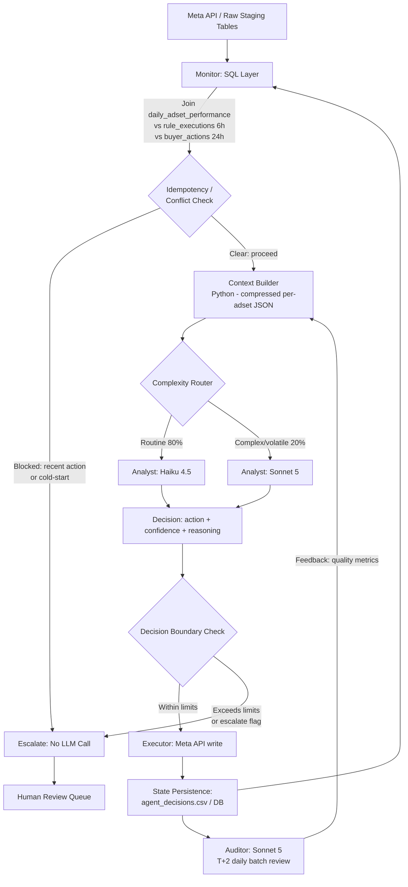

# Agent Army Architecture POC

## 1. Agent Topology

To replace the bulk of media buyer decision-making across 6 Meta ad accounts while controlling token expenditure and API latency, the system utilizes a multi-agent hierarchy separated by functional roles.

| Role                                | Responsibility                                                                                         | Input Context                                                                                                              | Permitted Actions                                                                          |
| :---------------------------------- | :----------------------------------------------------------------------------------------------------- | :------------------------------------------------------------------------------------------------------------------------- | :----------------------------------------------------------------------------------------- |
| **1. Monitor (SQL/Code)**           | High-frequency polling, deterministic pre-checks, threshold alerts, and formatting state for Analysts. | `daily_adset_performance` (last 3 days) `rule_executions` (last 6h for idempotency check) `buyer_actions` (last 24h) | Escalate to Analyst, Block execution (idempotency/cold-start), Trigger Auditor on anomaly. |
| **2. Analyst (LLM - Haiku/Sonnet)** | Contextual evaluation of trailing performance. Replaces manual "keep/kill/scale" decisions.            | Trailing 3-day performance arrays, historical rule failures, specific adset configurations.                                | `pause`, `scale_up`, `scale_down`, `keep`, `escalate` (to Human/Auditor).                  |
| **3. Auditor (LLM - Sonnet)**       | End-of-day asynchronous review of Analyst decisions and overall portfolio balance.                     | Aggregated JSON logs of all Analyst decisions for the day, account-level budgets.                                          | Flag specific adsets for human review, adjust next-day Analyst strictness prompts.         |

**Why this split?**

Running a heavy LLM on every adset every hour is financially unviable. The **Monitor** (cheap, deterministic code) filters out unviable adsets (e.g., <48h history, recent human touches). The **Analyst** handles the nuanced middle-ground of performance. The **Auditor** exists to catch cascading failures (e.g., the Analyst pausing 80% of an account's adsets due to a systemic Meta reporting delay).

## 2. Decision Boundaries & Guardrails

To operate safely without human supervision, the agents are constrained by hardcoded boundaries enforced at the code layer (not the LLM layer):

* **Autonomous Approvals:** `pause`, `keep`, and budget changes up to **±20%** of current daily budget.
* **Human Approval Required:** Budget changes >20%, reviving paused adsets, duplicating adsets, and resolving explicit `escalate` flags from the LLM.
* **Forbidden Actions:** Changing bid strategies, altering targeting parameters, or modifying campaign-level caps.
* **Maximum Exposure Ceilings:** The system tracks cumulative daily changes. If the sum of algorithmic budget increases across an account exceeds $500 in a 24-hour period, the execution layer physically blocks further `scale_up` API calls and pages a human.

## 3. The Economics (API Cost Estimation)

**Constraint:** $30/day maximum POC budget across 6 accounts.

**Model Selection Strategy:**

* **Claude Haiku 4.5 ($1.00 Input / $5.00 Output per 1M tokens):** Used for 80% of Analyst evaluations (standard daily performance reviews).
* **Claude Sonnet 5 ($2.00 Input / $10.00 Output per 1M tokens):** Used for 20% of Analyst evaluations (complex cases flagged by the Monitor, e.g., high volatility) and 100% of Auditor tasks.
* **No Model (SQL):** Used for idempotency checks, cold starts, and immediate human/rule conflict resolution.

**Estimated Daily Volume (Data-Grounded):**

* **Base Volume:** Based on `campaign_adset_metadata.csv` (Task A), there are ~4,000+ `ACTIVE` adsets across the 6 accounts. Daily performance logs indicate ~1,000 of these actively register spend and metrics on any given day.
* **The Pre-Check Funnel:** Based on Task C execution rates, the deterministic Monitor SQL filters out ~63.4% of active cases (cold starts, recent edits).
* **LLM Load:** ~366 adsets reach the Analyst layer daily.

  * ~293 evaluated by Haiku 4.5 (80%)
  * ~73 evaluated by Sonnet 5 (20%)

**Cost Math:**

* **Analyst (Haiku 4.5):** 293 calls × ~500 input / ~210 output tokens = 146,500 input ($0.147) + 61,530 output ($0.308) = **~$0.455/day**
* **Analyst (Sonnet 5):** 73 calls × ~500 input / ~210 output tokens = 36,500 input ($0.073) + 15,330 output ($0.153) = **~$0.226/day**
* **Auditor (Sonnet 5):** 1 call summarizing 366 JSON logs (~55,000 input tokens total) / ~2,000 output tokens = 55,000 input ($0.110) + 2,000 output ($0.020) = **~$0.130/day**
* **Total Estimated LLM API Cost:** **~$0.81 / day** ($24.30 / month)

**Breakeven Analysis:**

Grounded in actual dataset scale, executing this hybrid architecture costs ~$0.81/day across 6 accounts. Compared to a media buyer's salary (~$300/workday), **the API cost breakeven occurs at roughly 370x our current scale** ($300 ÷ $0.81). This means a single agent instance could theoretically evaluate over 370,000 adsets across 2,200 accounts before its daily API footprint matches the cost of one human buyer. This provides massive economic headroom to expand context windows (e.g., passing full campaign hierarchies) while remaining vastly more cost-effective than human labor.

## 4. Failure Modes & Kill Switches

| Failure Mode                       | Risk                                                                      | Mitigation / Guardrail                                                                                                   |
| :--------------------------------- | :------------------------------------------------------------------------ | :----------------------------------------------------------------------------------------------------------------------- |
| **1. Attribution Lag Panic**       | LLM pauses profitable adsets because intra-day revenue hasn't arrived.    | **Time-Gating:** LLM prompt enforces evaluation strictly on T-1 and T-2 data, treating "today" as incomplete by default. |
| **2. The "Pause Everything" Loop** | Systemic platform issue causes ROI drops; agent kills the whole account.  | **Account Velocity Cap:** Execution layer rejects `pause` calls if >15% of account budget is paused in one cycle.        |
| **3. Duplicate Execution**         | A cron job misfires and the agent scales an adset 5 times in an hour.     | **SQL State Lock:** Adsets are locked for 6 hours after any automated action.                                            |
| **4. Hallucinated Actions**        | LLM outputs `{ "action": "delete_account" }` despite schema.              | **Strict Schema Validation:** Python `pydantic` or manual validation defaults unrecognized outputs to `escalate`.        |
| **5. Infinite Token Loop**         | Formatting errors cause the agent to retry endlessly, burning API budget. | **Hard Cost Ceiling:** Global token tracker shuts down execution script immediately if daily API spend hits $5.00.       |

**The Kill-Switch:**

A single boolean flag (`AGENT_ACTIVE=False`) in the central `.env` file or database configuration instantly stops the execution layer. The Monitor continues to pull data and log *intended* actions for shadow-mode review, but the API write-permissions to Meta are completely severed.

## 5. Data Flow Architecture

1. **Ingestion (Cron / Webhook):** Meta API streams performance data into raw staging tables.
2. **Monitor (SQL Layer):**

   * Joins `daily_adset_performance` against `buyer_actions` and `rule_executions`.
   * *Key Prevention:* The 6-hour idempotency window directly addresses the duplicate firing issue, while the 24-hour buyer exclusion ensures the agent doesn't override humans.
3. **Context Construction (Python):**

   * Raw tables are NOT fed to the LLM.
   * Python scripts aggregate trailing 3-day metrics into isolated, compressed dictionaries per-adset to save tokens.
4. **Judgment (LLM API):**

   * The Analyst agent receives the targeted JSON context block and returns a structured decision.
5. **Execution (Meta API):**

   * Python parses the LLM output, applies the ±20% budget guardrails, and executes the Meta API call.
6. **State Persistence:**

   * The action is appended to `agent_decisions.csv` (or the production DB), feeding back into the Monitor's idempotency check for the next cycle.
